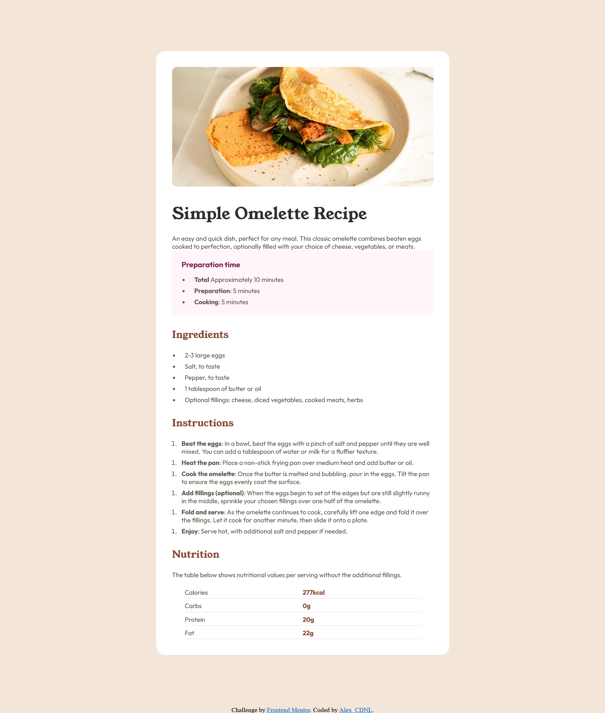

# Frontend Mentor - Recipe page solution

This is a solution to the [Recipe page challenge on Frontend Mentor](https://www.frontendmentor.io/challenges/recipe-page-KiTsR8QQKm). Frontend Mentor challenges help you improve your coding skills by building realistic projects. 

## Table of contents

  - [Screenshot](#screenshot)
  - [Links](#links)
  - [Built with](#built-with)
  - [What I learned](#what-i-learned)
  - [Continued development](#continued-development)
- [Author](#author)

### Screenshot

### Links

- Solution URL: [Add solution URL here](https://www.frontendmentor.io/solutions/recipe-page-rVdCbVJg75)
- Live Site URL: [Add live site URL here](https://frontend-mentor-recipe-page-alexcdnl.netlify.app/)

### Built with

- Semantic HTML5 markup
- CSS custom properties
- Flexbox
- CSS Grid
- SCSS

### What I learned

Better use of SCSS, could have been way more optimized especially with font family and colors.

### Continued development

Keep going with scss, be faster, better optimization. 

## Author

- Frontend Mentor - (https://www.frontendmentor.io/profile/Alex-CDNL)
